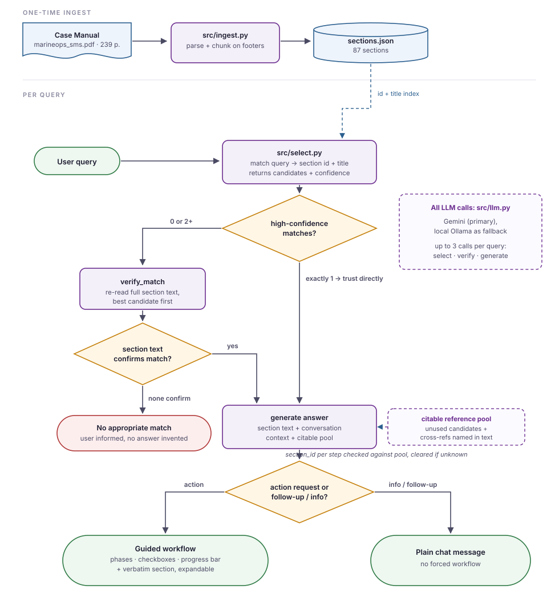

# Written overview AI use case - Reshaped x Rénan
## What I built
An LLM-powered guided workflow chat interface, with responses grounded in the VIMS marine operations safety management manual, also including the original section for manual confirmation.

Most of my effort went into getting useful responses from the LLM. Switching from the local Qwen3:8B to the Google Gemini Flash 3.1 Lite model significantly improved the performance, but still a lot of context engineering was required to get consistently useful responses.

## The user problem it addresses
With hundreds of pages and tens of sections, this solution enables marine personnel to quickly find the next critical steps during malfunctions, near misses, incident reporting etc. Instead of scrolling through the SMS, the user instantly knows which steps they have to take, while the interface can also provide the full document text when needed for peace of mind.

  ## How it works
  

  1. `src/ingest.py` parses the PDF into 87 sections using regex. The resulting chunks are saved in a JSON file in `data/processed/sections.json`.
  2. `src/select.py` matches the question against section id + title using the LLM, returns candidates with confidence (`low`, `medium`, `high`).
 3. `src/router.py` directly returns high-confidence matches, or verifies matches against the section text if there are zero or multiple high-confidence candidates. If a follow-up question doesn't retrieve a new match, the conversation stays on the previously used section rather than escalating or guessing. Other candidate sections, plus any sections named by title inside the primary section's own text (cross-references), form a pool the model may cite from, but any section id the model attaches to a step is checked against that pool after generation, and cleared if it doesn't match, so a citation can never point to a section that wasn't actually available. An appropriate response is generated using this context alongside the conversation history. When appropriate, the response is rendered as a guided workflow, otherwise as a plain chat message; the same generation step also holds a rule to decline attempts to override its instructions.
  4. `src/llm.py` handles the calls to the Gemini or local Ollama LLM. If the Gemini API is not responding, the local model is automatically loaded as a fallback.
  5. `app.py` renders the user interface: a chat interface with toggleable elements and a progress bar when the LLM returns a guided workflow. Alternatively a plain text message can be rendered also. When the response is grounded in specific sections, the original section text is also presented as an expandable element.
  6. `src/format.py` recovers the original styling from the flattened JSON text data for easier reading of the original sections.

## Key design decisions and trade-offs
### Section-based chunking.
In favor of section-agnostic fixed window chunking. Eases the amount of sections the LLM needs to read, and prevents answers based on irrelevant sections since only one section can be retrieved at a time.

### LLM-based section retrieval on titles.
Pivoted from BM25 + sentence transformers search (`archive/search_old.py`) to LLM retrieval. BM25 + sentence transformers did not capture user intent, only exact phrases used in the query. LLM retrieval causes more latency and is more expensive, but the results are far superior, and for this small dataset it is not a problem.

### Guided workflow UI through chat interface.
Opted for a GUI chat interface with guided workflows so the LLM can answer flexibly through plain responses while still allowing specific workflows to be presented in a usable format with clickable elements and a progress bar. A pure chat interface would be less complicated, but would lose the clarity needed to turn documentation into actionable points.

### Verify before generation for ambiguous matches, not for high confidence.
If there is a single high confidence match, it is most likely for a reason and will be returned immediately to save latency and LLM costs. If there are 0 or 2+ high confidence matches verification ensures only sections that answer the user query are used to generate an answer. In practice this avoids using irrelevant sections, and allows the LLM to truthfully answer when the SMS does not have the answer.

### Cloud model with local backup.
While originally this implementation started from an unchecked assumption (on sea there will likely be a bad connection), after asking it turned out that a stable internet connection could be assumed after all. While removing the offline local backup would improve simplicity as it does not serve an immediate purpose now, I opted to maintain it for my own insurance, as a sketchy internet connection could ruin my demonstration.

### No vector database.
While RAG often uses vectorized databases, in this case the document is short enough to use the plain text. Implementing this would likely hurt retrieval performance while not significantly decreasing latency.

### Citable reference pool instead of free citation.
Rather than letting the model cite any section number it wants, or restricting it to only the single retrieved section, unused retrieval candidates and sections named inside the primary text form a pool it may cite from, checked against that pool after generation. This allows richer, cross-referencing answers without opening the door to invented section numbers.

## Evaluation
Quality was measured throughout development to guide the direction of this application. Retrieval of the correct sections is evaluated through `eval/test_select.py`, where a number of queries are tested for accuracy (13/14 sections retrieved successfully, 1 miss is on no appropriate section found, which is caught by the verification step).

In `eval/test_router.py` three tests are performed. The first addresses retrieval of a purposely misleading query and ensures that the right sections is still returned (3/3 handled successfully). Test 2 tests prompt injection and normal plain text answers against an issue where the LLM would return inappropriate answers (no inappropriate answers returned). Test 3 tests consistency by running the same query multiple times to see how the output changes due to LLM noise (person responsible remains inconsistent with every response citing at least one different person for one of the steps, wording of steps differs per query but meaning is essentially identical).

In `eval/debug_finger.py` a specific issue was debugged where a small finger cut was either unmatched completely, gave an answer that was not grounded on the SMS, or falsely elevated the seriousness to a life-threatening level. Fixed by context engineering, the model is explicitly instructed to retrieve sections no matter the severity, and the severity is addressed when generating the response.

## How I would scale this
1. Currently retrieval does not scale well if there would be more sections. Hierarchical selection, where the appropriate source is selected first, then the right chapter, and then the section, could solve this issue. Another solution would be a vectorstore used to preselect potential candidates before LLM selection.

2. Up to 3 LLM calls are made per query (select, verify, generate), with verify being most expensive with LLM calls quickly increasing for ambiguous results. Verification results could be cached for common questions, or in general over the entire user pool to save LLM costs.

3. Moving away from Streamlit and onto a stateless API behind a separate frontend would allow this application to scale to larger user groups using it simultaneously, as well as improving latency and general performance as Streamlit can be slow on some hardware.

4. Ingestion should be handled automatically after every revision of the safety manual(s) instead of only run once manually on this specific version of the SMS.

5. There is no logging over sessions whatsoever. Enabling logging could monitor the quality of the responses over time to see how the user base is using the application. User questionnaires would also be a part of this to get direct feedback.

## What I would refine with more time
I would include the forms in the marine operations SMS, which are now ignored. Also external relevant sources (like COLREGS, 46 CFR 4.05-1 and NVIC 01-15, 46 CFR Part 4 and Form CG-2692, and SOLAS/MARPOL/STCW) could be added to assist in increasing the accuracy of LLM responses. Currently, the category of queries is ignored. In the future separate workflows could be made for equipment malfunctions, safety incidents or near misses, emergency or abnormal operations, and operational non-compliance.

## Known limitations
- Section ids cited on workflow steps are validated against known sections after generation, but the step text itself, plus the subtitle and callout fields, are free text and rely on prompt instructions rather than mechanical checks. The model could still describe a step inaccurately even when its citation is correct.
- Only one section is used per answer.
- Chat history quickly accumulates and is never summarized or saved, causing higher API costs and potential hallucination of previous questions in the same session.
- Section matching is not deterministic, meaning the same query could result in different sections being selected.
- The sections/chunks are ingested with regex but never fully read for errors.
- Prompt injection holds in simple tests but resilience cannot be guaranteed through a system prompt alone.
- The local fallback model is limited in its potential to correctly cite specific sources and numbers, and loading the model and generating responses have high latency related to the hardware used to run it.